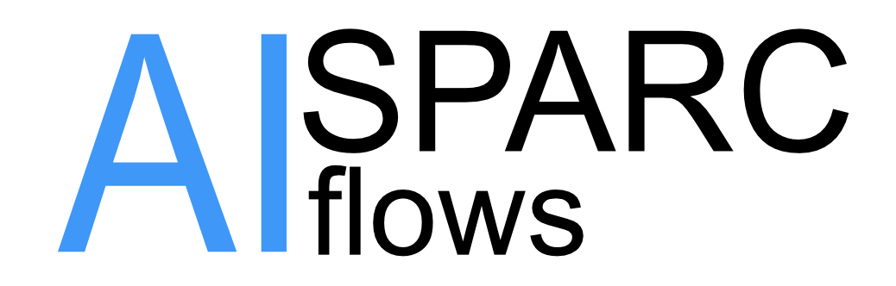
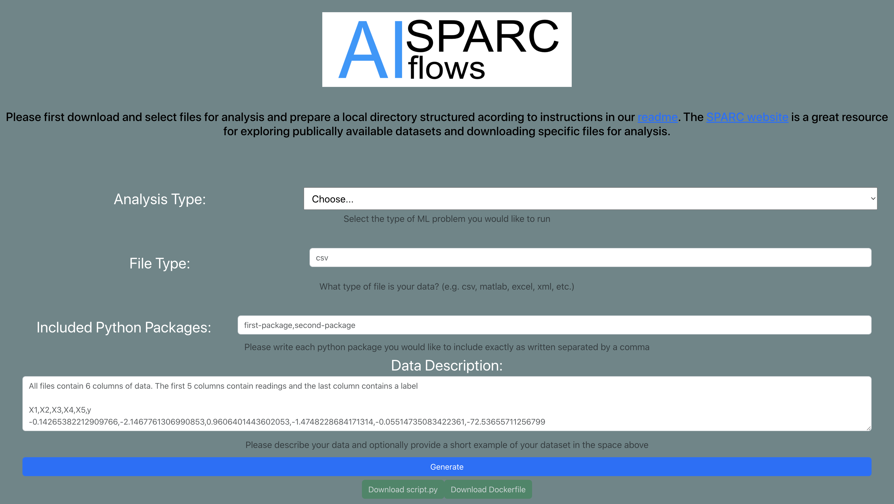
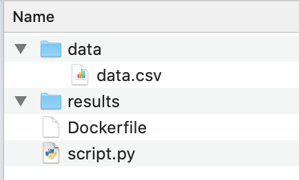
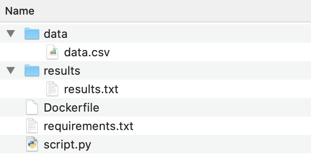

<p style="text-align:center"></p>

A tool for **Fast** and **Small savable workflows** for SPARC data analysis

# What is "AI SPARC flows"?
This project consists of a dashboard implemented with React (frontend) and Flask (backend) that allows users to input desired analysis to be performed on datasets from the SPARC data repository. The requested analysis is used to generate a prompt that is then sent to ***ChatGPT via the OpenAI API*** (a Large Language Model), which in turn generates a Dockerfile and Python script that is returned to the user. The user runs the Dockerfile to create a Docker image with the appropriate analysis environment and the Python script is used to complete the data analysis.

# Why use this tool? 
This tool reduced two pain points in the analysis of SPARC data.

***Fast preliminary analysis!*** Using AI generated workflows, get an initial answer to a research question immediately compared to days or weeks. The insights generated in the initial result can be used to drive deeper follow-up analyses.

***Small footprint saved workflows!*** The end result of these fast analyses is a workflow represented in three small text files: (1) a Python script file, "script.py"; (2) a Dockerfile used to build the Docker image; and (3) a "requirements.txt" file that lists the versions of essential analysis packages used in the Docker image at runtime. These files can then be used to reproduce the analysis or as building blocks for more comprehensive analyses.

## Requirements
* [OpenAI](https://openai.com/) API Key for ChapGPT
* [Docker Desktop](https://www.docker.com/products/docker-desktop/)

# Installation
In order to properly have the dashboard generate files, you will need to first clone this repo to a local directory.

To run the dashboard locally, first navigate to the dashboard subdirectory and run the command
```npm install```
Once installed, you should be able to run the command
```npm start```
and your browser should automatically open a window displaying the dashboard on localhost 3000.

In a seperate terminal, you will need to run the flask server file
```server.py```. To do so, you will navigate to the backend subdirectory and run the command
```python server.py```. If you do not have flask installed, you can run the command
```pip install flask``` or check out flask's installation guide [here](https://flask.palletsprojects.com/en/2.3.x/installation/).
Some other packages that our server requires, which you might need to install, include openai, tiktoken, and PyYAML. If you do not have these installed, run the commands
```pip install openai```
```pip install tiktoken```
```pip install PyYAML```


The code requires a yaml file containing the user's OpenAI API key, named "creds.yaml", be placed directly outside the git repo.

# Dashboard Overview
The dashboard allows the user to select the type of analysis (ML Problem), file type, included python packages, and to provide a description of the data.

Supported Analyses:
* Regression Modeling
* Classification Modeling
* Statistical Description Analysis

Supported File Types:
* CSV
* Matlab
* Excel
* XML

Python packages are installed with pip from the Python Package Index (PyPI).

A short description of the data should be provided in the Data Description text box. A short example of the dataset can also be, optionally, provided.



# Instructions for Use
1. **Create a local folder** for the analysis to contain the data and files downloaded from the Dashboard. Add two subdirectories named "results" (where the analysis results will output results to a results.txt file) and another named "data" into which you will place the data files you will run your analysis on.

2. **Download data**, using the SPARC website, to the local sub-folder that will contain the data in this location, named "data". Your local directory should look something like this:
<p style="text-align:center"></p>

3. **Generate the analysis files**, using the dashboard, by inputing the analysis information and clicking Generate. The custom Python script and Dockerfile will automatically be generated and can be downloaded to the local folder.

4. **Build the Docker image**, in the command line interface (CLI), by navigating to the local folder and running the command to build the image:
    ```
    docker build -t sparc_analysis_image .
    ```
5. **Run the analysis** in the CLI, in the local folder. Obtain the \<absolute path\> by running `pwd` in most Unix shells (Linux/MacOS), `cd` in Windows Command Prompt, or `Get-Location` in Windows PowerShell. Then run the following command to create the docker image and run the analysis, which will produce a sub-folder named "results":
    ```
    docker run -v <absolute path>:/app sparc_analysis_image:latest
    ```
    After running your analysis, your directory should look something like this:
<p style="text-align:center"></p>

6. **Cleanup: Remove the Docker container and image**, using the CLI, by running the following command:
    ```
    docker stop SPARC_analysis_image:latest && docker rm sparc_analysis_image:latest && docker rmi -f sparc_analysis_image:latest
    ```

# [SPARC FAIR Codeathon 2023](https://sparc.science/news-and-events/events/2023sparc-codeathon) — Team 6
**Team members:**
* Charles Horn
* John Bentley
* Mason Mings

# License
AI SPARC flows is distributed under the [MIT License](https://opensource.org/license/mit/).

2023

Permission is hereby granted, free of charge, to any person obtaining a copy of this software and associated documentation files (the “Software”), to deal in the Software without restriction, including without limitation the rights to use, copy, modify, merge, publish, distribute, sublicense, and/or sell copies of the Software, and to permit persons to whom the Software is furnished to do so, subject to the following conditions:

The above copyright notice and this permission notice shall be included in all copies or substantial portions of the Software.

THE SOFTWARE IS PROVIDED “AS IS”, WITHOUT WARRANTY OF ANY KIND, EXPRESS OR IMPLIED, INCLUDING BUT NOT LIMITED TO THE WARRANTIES OF MERCHANTABILITY, FITNESS FOR A PARTICULAR PURPOSE AND NONINFRINGEMENT. IN NO EVENT SHALL THE AUTHORS OR COPYRIGHT HOLDERS BE LIABLE FOR ANY CLAIM, DAMAGES OR OTHER LIABILITY, WHETHER IN AN ACTION OF CONTRACT, TORT OR OTHERWISE, ARISING FROM, OUT OF OR IN CONNECTION WITH THE SOFTWARE OR THE USE OR OTHER DEALINGS IN THE SOFTWARE.
